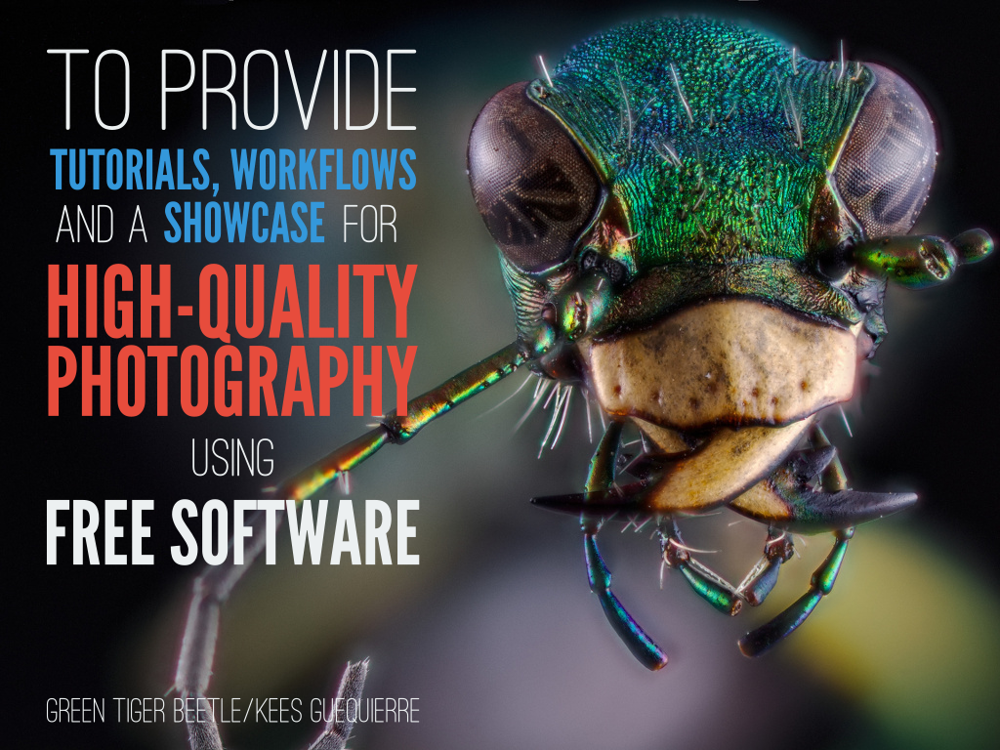
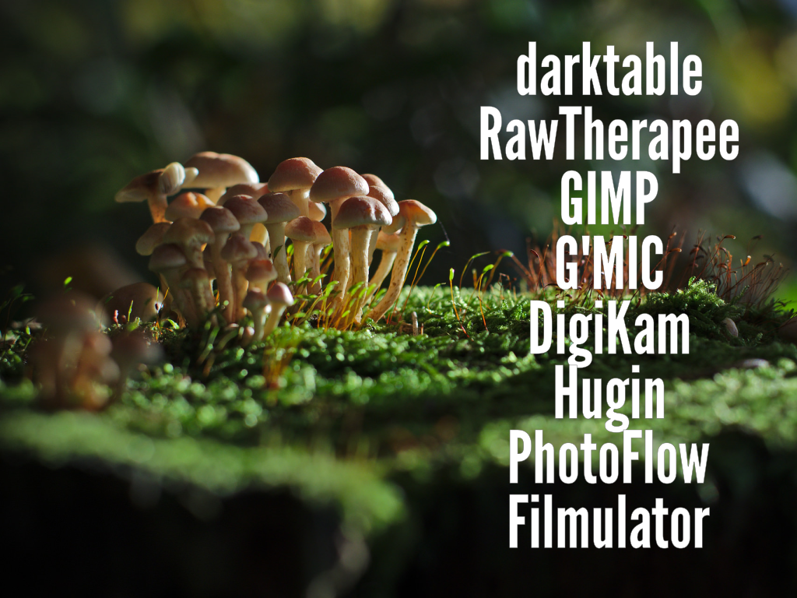

# Southern California Linux Expo (SCaLE) 16x
March 9, 2018, Pasadena, CA (Pasadena Convention Center)

Slides created by [Pat David][] with help from houz, Mimir, andabata, and more.
[Pat David]: https://github.com/patdavid

Image credits:
* [Green Tiger Beetle][] by Kees Guequierre
* [Milkyway Rising][] by Jonas Wagner
* Mushroom Forest by Philipp Haegi

[Green Tiger Beetle]: https://www.flickr.com/photos/andabata/20025243436
[Milkyway Rising]: https://www.flickr.com/photos/80225884@N06/21294786925/in/dateposted/

Slide 1
-------
**PIXLS.US**  
_Building a Freedom Based Photography Community_

---

Slide 2
-------

 

---

Slide 3
-------

 

---

Slide4 
-------
 
---

Slide4 
-------
 
---

Slide 5 
-------
 
---

Slide 6 
-------
 
---

Slide 7 
-------
 
---

Slide 8 
-------
 
---

Slide 9 
-------
 
---

Slide 10
-------
 
