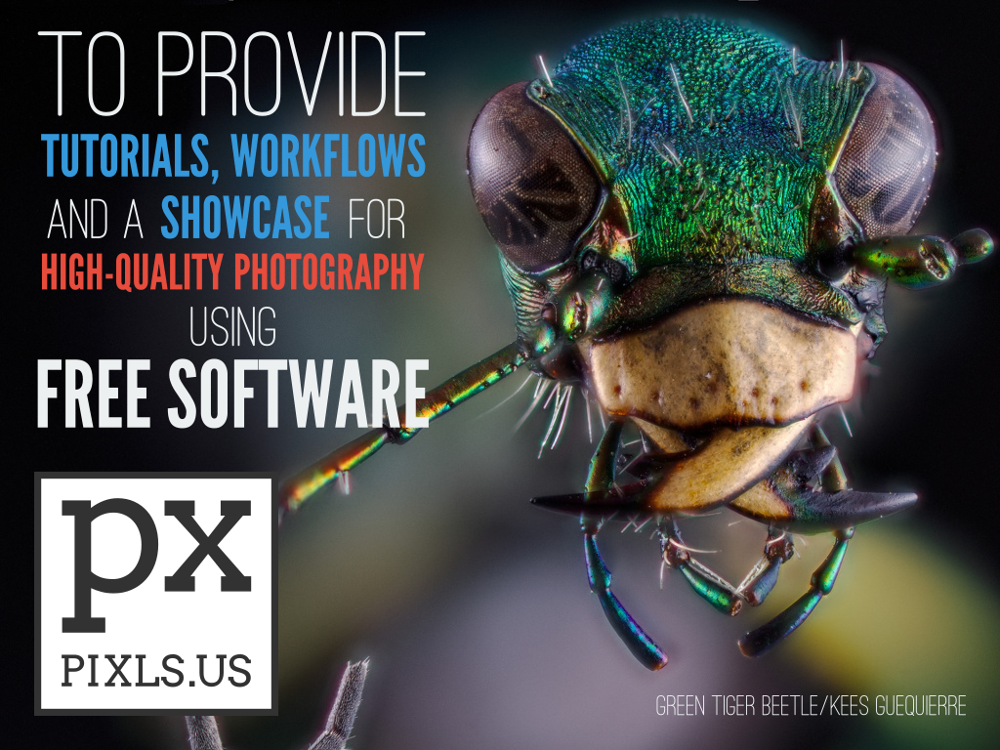
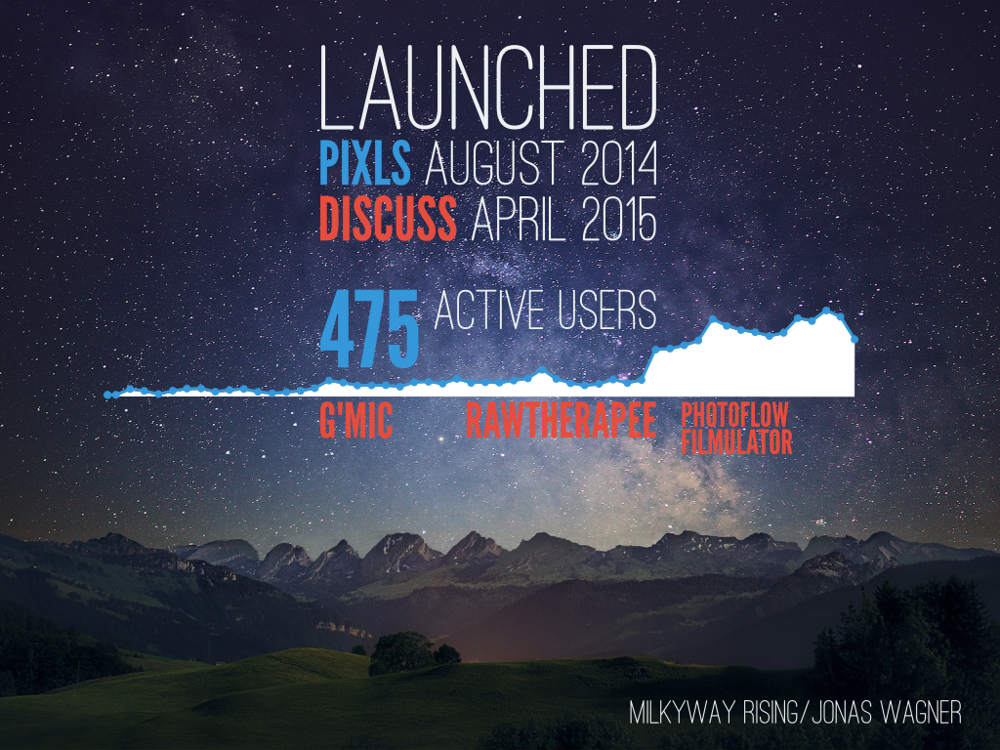
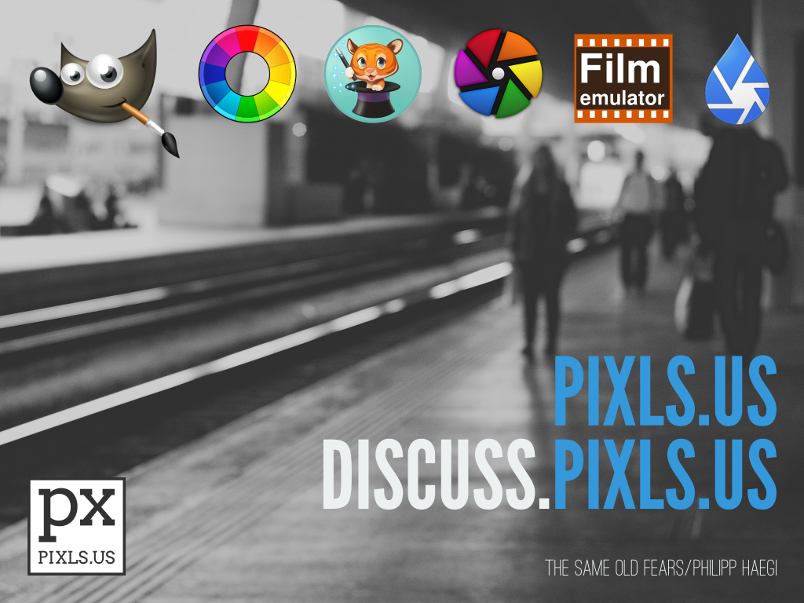

# Libre Graphics Meeting 2016 - _State of the Libre Graphics_
April 15, 2016, London, UK (University of Westminster)

Slides created by [Pat David][] with help from houz, Mimir, andabata, and more.
[Pat David]: https://github.com/patdavid

Image credits:
* [Green Tiger Beetle][] by Kees Guequierre
* [Milkyway Rising][] by Jonas Wagner
* [The Same Old Fears][] by Philipp Haegi

[Green Tiger Beetle]: https://www.flickr.com/photos/andabata/20025243436
[Milkyway Rising]: https://www.flickr.com/photos/80225884@N06/21294786925/in/dateposted/
[The Same Old Fears]: https://www.flickr.com/photos/philipphaegi/25508933915/in/dateposted/

Slide 1
-------
**PIXLS.US**  
_Free/Open Source Photography_

The community mission statement:
> _To provide tutorials, workflows and a showcase for high-quality photography using Free/Open Source Software._

---

Slide 2
-------
After kicking the idea around at LGM2014, the main site was built and (soft) launched in August, 2014.
The forums (Discuss) were finally launched April, 2015.

Since Discuss was launched just over a year ago, it has gained 475 active users.

Several Free Software projects use Discuss as their official forums: G'MIC, RawTherapee, PhotoFlow, and Filmulator.

* The traffic graph shows pageviews by week.
* The first small spike by G'MIC is when they moved their forums to discuss.
* The second (very big) spike is when RawTherapee moved their forums over (it's the large spike near the last "E" in "RawTherapee".

---

Slide 3
-------
There will be a longer presentation about building the community at 15:40 on Saturday by Pat David.

Come and join fellow photographers and Free Software supporters at PIXLS.US!

