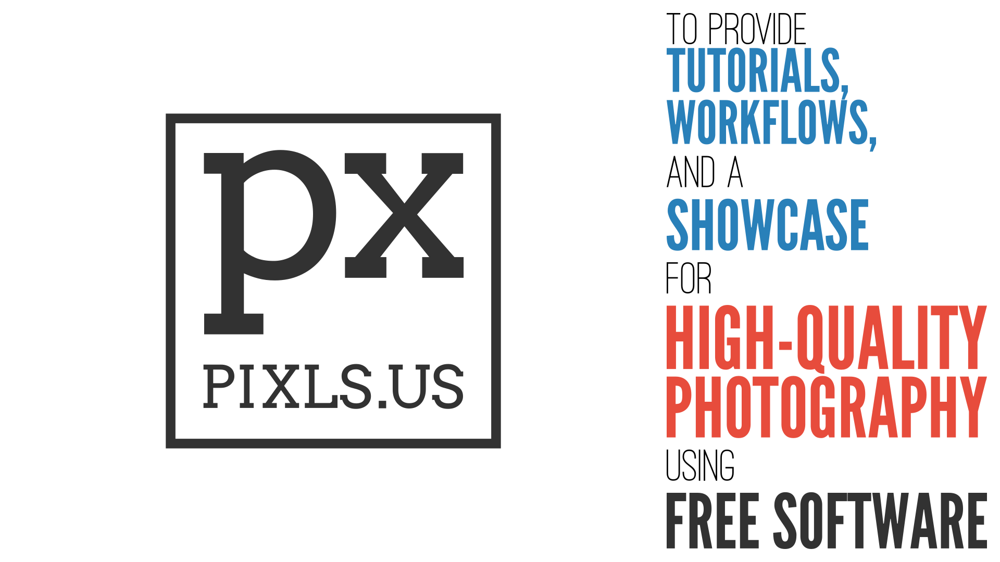
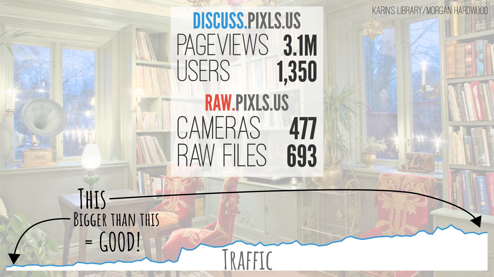

# Libre Graphics Meeting 2017 - _State of the Libre Graphics_
April 20, 2016, Rio de Janeiro, Brazil

Slides created by [Pat David][] with help from Morgan Hardwood, Mimir, andabata, and more.

[Pat David]: https://github.com/patdavid

Image credits:
* Karin's Library by Morgan Hardwood (CC-By-SA-NC)
* Untitled by Mimir

Slide 1
-------
**PIXLS.US**  
Is a community brought together by Free Software

The goal of the community is:
> _To provide tutorials, workflows and a showcase for high-quality photography using Free/Open Source Software._

---

Slide 2
-------
The community has had an amazing year!
The forums have seen over 3.1M pageviews and has grown to over 1,350 users.

We have started raw.pixls.us to store and make available raw files for any project to use for testing or other purposes.
This is to replace the old rawsamples.ch website that is no longer functioning.
To date we have 693 raw sample files from 477 different cameras.
Please check the site and donate raw samples to help!

Traffic has grown steadily since we started and we have an active and engaged community.

We are hoping to help Free Software photography projects with any infrastructure support they may need.

---

Slide 3
-------
We are always looking forward to meeting new folks, so please come join us and help us grow the community!

